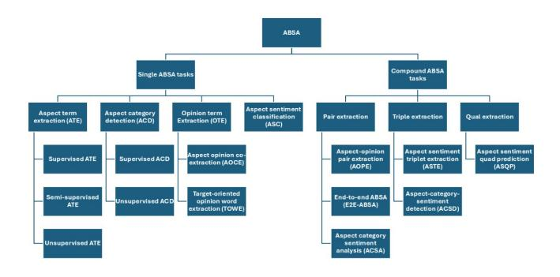

# A Benchmark Dataset for Implicit Aspect Detection

Sepideh Ahmadian University of Windsor ahmadia3@uwindsor.ca

## Abstract

Customer reviews on e-commerce platforms provide valuable insights but pose challenges due to their high volume and unstructured nature. Aspect-based sentiment analysis (ABSA) identifies opinions on product features; however, detecting implicit aspects remains difficult due to limited datasets. To our knowledge, no dedicated dataset exists for this purpose. This study aims to develop a dataset for implicit aspect detection, structuring reviews into inferred aspects, opinion words, and sentiment.

# Keywords

Implicit aspect detection, Dataset curation, Aspect-based sentiment analysis

## 1 History

The origins of review analysis can be traced back to ancient intellectual traditions, where scholars systematically compiled, critiqued, and synthesized existing knowledge. Classical philosophers such as Aristotle and later medieval commentators laid the groundwork for structured discourse analysis, a practice that evolved significantly during the Enlightenment when systematic inquiry became central to academic research [\[2\]](#page-1-0). By the 20th century, this tradition gave rise to formalized methods such as systematic literature reviews and meta-analyses, particularly in medicine and social sciences, where researchers established protocols such as PRISMA to ensure methodological rigour and transparency [\[4,](#page-1-1) [11\]](#page-1-2).

The digital era marked a paradigm shift in review analysis. The emergence of the internet and the proliferation of e-commerce platforms like Amazon and Yelp in the late 20th and early 21st centuries led to an unprecedented surge in user-generated content [\[3\]](#page-1-3). Unlike traditional expert reviews, this democratization of feedback created vast repositories of consumer opinions, necessitating new approaches to information processing. Advances in natural language processing (NLP) and machine learning enabled researchers to analyze sentiment, detect trends, and extract meaningful insights from massive text datasets in real-time [\[12\]](#page-1-4).

## 2 Review Analysis

Traditional sentiment analysis methods assess sentiment at a document or sentence level but often assume a single sentiment per sentence, overlooking the complexity of multiple opinions on different aspects. This limitation led to the emergence of ABSA, which enables fine-grained identification of sentiments linked to specific aspects.[\[20\]](#page-1-5) ABSA consists of two key components: the target and sentiment, where targets can be explicit (e.g., "pizza" in "The pizza is delicious") or implicit (e.g., "It is overpriced!"). Sentiment includes both opinion terms and polarity (positive, negative, or neutral) [\[8\]](#page-1-6). ABSA tasks are categorized into single tasks, such as aspect term extraction, or compound tasks, like aspect-opinion pair extraction,

Kap Thang University of Windsor thangk@uwindsor.ca

which identify relationships between aspects and opinions. (All the categories are shown in Figure [1\)](#page-1-7) This research focuses on constructing a specialized dataset for single-task ABSA, specifically targeting implicit aspect detection. It addresses a significant gap in existing datasets, which primarily annotate explicit aspects while overlooking those requiring contextual inference.

## 2.1 Implicit Aspect Detection

ABSA offers fine-grained sentiment categorization linked to specific aspects of products. Within ABSA, implicit aspect detection (IAD) addresses the challenge of identifying aspects that are not explicitly mentioned but are inferred from context—a critical task for enhancing the robustness of sentiment analysis systems. Several surveys have explored absa, though often with limited focus on IAD. Schouten and Frasincar [\[15\]](#page-1-8) provided a comprehensive overview of aspect-level sentiment analysis, primarily concentrating on explicit aspects without dedicated attention to implicit ones. On the other hand, Tubishat et al. [\[17\]](#page-1-9) presented a detailed review of IAD methodologies, introducing extensive subcategories that, while thorough, complicated comparative analysis. Research methods in IAD encompasses unsupervised [\[1,](#page-1-10) [16,](#page-1-11) [21\]](#page-1-12), supervised [\[7\]](#page-1-13), and hybrid approaches [\[5,](#page-1-14) [9,](#page-1-15) [14\]](#page-1-16), employing techniques from statistical co-occurrence to advanced machine learning models.

Unsupervised methods detect implicit aspects without annotated training data, leveraging linguistic cues, co-occurrence statistics, and semantic relationships. Zhang and Zhu [\[21\]](#page-1-12) proposed a cooccurrence-based method using association matrices to capture relationships between opinion and aspect words, enhancing precision in implicit aspect identification. Bagheri et al. [\[1\]](#page-1-10) developed graph-based representations where aspects and opinion words are nodes connected by weighted edges based on co-occurrence frequencies, providing a dynamic framework for mapping implicit sentences to corresponding aspects. Zhang et al. [\[18\]](#page-1-17) enhanced lda with knowledge constraints, incorporating domain-specific lexicons to improve the relevance of detected topics. Supervised approaches utilize annotated data to train classifiers for IAD, ranging from traditional machine learning techniques to deep learning models. Classification-based methods, such as Hu et al. [\[7\]](#page-1-13), employed support vector machines (SVMs) trained on contextual n-grams surrounding aspect words, achieving high accuracy in both explicit and implicit aspect detection by leveraging localized context. Hybrid methods integrate supervised and unsupervised approaches to balance accuracy and generalizability. Hai et al. [\[5\]](#page-1-14) performed unsupervised clustering to group explicit aspects, followed by supervised learning to map implicit sentences to the most likely aspect cluster, leveraging the strengths of both methodologies.

## 3 The Role of LLMs in Dataset Curation

Large Language Models (LLMs) have emerged as powerful tools for dataset curation and generation tasks, demonstrating robust Conference'17, July 2017, Washington, DC, USA Sepideh Ahmadian and Kap Thang

Figure 1: ABSA Categories.

capabilities in understanding natural language semantics and structures, particularly suitable for curating high-quality datasets for implicit aspect detection.

Recent works show that LLMs excel at generating and curating datasets through their strong reasoning and contextual understanding abilities [\[19\]](#page-1-18). When provided with appropriate contextual information and prompts, LLMs can effectively curate data while preserving domain knowledge [\[6\]](#page-1-19). This is valuable for tasks like implicit aspect detection, where context and semantic understanding are crucial. However, the quality of prompts and contextual information significantly impacts the curation outcome [\[13\]](#page-1-20). Second, careful data selection and filtering mechanisms are necessary to ensure the curated datasets maintain high quality while avoiding potential biases [\[10\]](#page-1-21). Lastly, the choice of LLM and its configuration parameters plays a crucial role in determining the quality of the curated data [\[19\]](#page-1-18).

The evolution from traditional review analysis to modern implicit aspect detection represents a significant progression in the field. While early approaches relied on manual annotation and rulebased systems, the field has advanced through various stages: from basic sentiment analysis to fine-grained ABSA, and from explicit to implicit aspect detection using unsupervised, supervised, and hybrid approaches. By leveraging their advanced contextual understanding and semantic reasoning capabilities [\[8\]](#page-1-6), LLMs can assist in identifying and annotating implicit aspects at scale, overcoming the limitations of traditional annotation methods [\[20\]](#page-1-5). This convergence of historical development, methodological advancement, and modern AI capabilities indicates more robust and comprehensive solutions for understanding and analyzing user-generated content.

## References

- [1] Ayoub Bagheri, Mohamad Saraee, and Franciska de Jong. 2013. Care more about customers: Unsupervised domain-independent aspect detection for sentiment analysis of customer reviews. Knowl. Based Syst. 52 (2013), 201–213. [https:](https://doi.org/10.1016/J.KNOSYS.2013.08.011) [//doi.org/10.1016/J.KNOSYS.2013.08.011](https://doi.org/10.1016/J.KNOSYS.2013.08.011)
- [2] BENJAMIN S. BLOOM. 1984. The 2 Sigma Problem: The Search for Methods of Group Instruction as Effective as One-to-One Tutoring. Educational Researcher 13, 6 (1984), 4–16.<https://doi.org/10.3102/0013189X013006004> arXiv[:https://doi.org/10.3102/0013189X013006004](https://arxiv.org/abs/https://doi.org/10.3102/0013189X013006004)
- [3] Yubo Chen and Jinhong Xie. 2008. Online Consumer Review: Word-of-Mouth as a New Element of Marketing Communication Mix. Manag. Sci. 54, 3 (2008), 477–491.<https://doi.org/10.1287/MNSC.1070.0810>
- [4] Harris Cooper. 2017. Research Synthesis and Meta-Analysis: A Step-by-Step Approach.<https://doi.org/10.4135/9781071878644>
- [5] Zhen Hai, Kuiyu Chang, Gao Cong, and Christopher C. Yang. 2015. An Association-Based Unified Framework for Mining Features and Opinion Words. ACM Trans. Intell. Syst. Technol. 6, 2 (2015), 26:1–26:21. [https://doi.org/10.1145/](https://doi.org/10.1145/2663359)

[2663359](https://doi.org/10.1145/2663359)

- [6] Farinam Hemmatizadeh, Christine Wong, Alice Yu, and Hossein Fani. 2023. Latent Aspect Detection via Backtranslation Augmentation. In Proceedings of the 32nd ACM International Conference on Information and Knowledge Management, CIKM 2023, Birmingham, United Kingdom, October 21-25, 2023, Ingo Frommholz, Frank Hopfgartner, Mark Lee, Michael Oakes, Mounia Lalmas, Min Zhang, and Rodrygo L. T. Santos (Eds.). ACM, United Kingdom, 3943–3947. [https://doi.org/10.1145/](https://doi.org/10.1145/3583780.3615205) [3583780.3615205](https://doi.org/10.1145/3583780.3615205)
- [7] Xing Hu, Sukanya Manna, and Brian N. Truong. 2014. Product aspect identification: Analyzing role of different classifiers. In 2014 IEEE Symposium on Computational Intelligence and Data Mining, CIDM 2014, Orlando, FL, USA, December 9-12, 2014. IEEE, 202–209.<https://doi.org/10.1109/CIDM.2014.7008668>
- [8] Bing Liu. 2012. Sentiment Analysis and Opinion Mining. Morgan & Claypool Publishers.<https://doi.org/10.2200/S00416ED1V01Y201204HLT016>
- [9] Bing Liu, Minqing Hu, and Junsheng Cheng. 2005. Opinion observer: analyzing and comparing opinions on the Web. In Proceedings of the 14th international conference on World Wide Web, WWW 2005, Chiba, Japan, May 10-14, 2005, Allan Ellis and Tatsuya Hagino (Eds.). ACM, 342–351. [https://doi.org/10.1145/1060745.](https://doi.org/10.1145/1060745.1060797) [1060797](https://doi.org/10.1145/1060745.1060797)
- [10] Xiaoqun Liu, Jiacheng Liang, Luoxi Tang, Chenyu You, Muchao Ye, and Zhaohan Xi. 2024. Buckle Up: Robustifying LLMs at Every Customization Stage via Data Curation. CoRR abs/2410.02220 (2024). [https://doi.org/10.48550/ARXIV.2410.](https://doi.org/10.48550/ARXIV.2410.02220) [02220](https://doi.org/10.48550/ARXIV.2410.02220) arXiv[:2410.02220](https://arxiv.org/abs/2410.02220)
- [11] D. Moher, A. Liberati, Jennifer Tetzlaff, Douglas Altman, Gerd Antes, D. Atkins, Virginia Barbour, N. Barrowman, Jesse Berlin, Jocalyn Clark, M. Clarke, D. Cook, Roberto D'Amico, Jonathan Deeks, P.J. Devereaux, Kay Dickersin, Matthias Egger, Edzard Ernst, P.C. Gøtzsche, and Peter Tugwell. 2014. Preferred Reporting Items for Systematic Reviews and Meta-Analyses: The PRISMA Statement. Revista Espanola de Nutricion Humana y Dietetica 18 (01 2014), 172–181.
- [12] Bo Pang and Lillian Lee. 2007. Opinion Mining and Sentiment Analysis. Found. Trends Inf. Retr. 2, 1-2 (2007), 1–135.<https://doi.org/10.1561/1500000011>
- [13] Jinlong Pang, Jiaheng Wei, Ankit Parag Shah, Zhaowei Zhu, Yaxuan Wang, Chen Qian, Yang Liu, Yujia Bao, and Wei Wei. 2024. Improving Data Efficiency via Curating LLM-Driven Rating Systems. CoRR abs/2410.10877 (2024). [https:](https://doi.org/10.48550/ARXIV.2410.10877) [//doi.org/10.48550/ARXIV.2410.10877](https://doi.org/10.48550/ARXIV.2410.10877) arXiv[:2410.10877](https://arxiv.org/abs/2410.10877)
- [14] Soujanya Poria, Erik Cambria, Lun-Wei Ku, Chen Gui, and Alexander F. Gelbukh. 2014. A Rule-Based Approach to Aspect Extraction from Product Reviews. In Proceedings of the Second Workshop on Natural Language Processing for Social Media, SocialNLP@COLING 2014, Dublin, Ireland, August 24, 2014, Shou-de Lin, Lun-Wei Ku, Erik Cambria, and Tsung-Ting Kuo (Eds.). Association for Computational Linguistics and Dublin City University, 28–37.<https://doi.org/10.3115/V1/W14-5905>
- [15] Kim Schouten and Flavius Frasincar. 2016. Survey on Aspect-Level Sentiment Analysis. IEEE Trans. Knowl. Data Eng. 28, 3 (2016), 813–830. [https://doi.org/10.](https://doi.org/10.1109/TKDE.2015.2485209) [1109/TKDE.2015.2485209](https://doi.org/10.1109/TKDE.2015.2485209)
- [16] Qi Su, Kun Xiang, Houfeng Wang, Bin Sun, and Shiwen Yu. 2006. Using Pointwise Mutual Information to Identify Implicit Features in Customer Reviews. In Computer Processing of Oriental Languages. Beyond the Orient: The Research Challenges Ahead, 21st International Conference, ICCPOL 2006, Singapore, December 17-19, 2006, Proceedings (Lecture Notes in Computer Science, Vol. 4285), Yuji Matsumoto, Richard Sproat, Kam-Fai Wong, and Min Zhang (Eds.). Springer, 22–30. [https://doi.org/10.1007/11940098\\_3](https://doi.org/10.1007/11940098_3)
- [17] Mohammad Tubishat, Norisma Idris, and Mohammad A. M. Abushariah. 2018. Implicit aspect extraction in sentiment analysis: Review, taxonomy, oppportunities, and open challenges. Inf. Process. Manag. 54, 4 (2018), 545–563. [https:](https://doi.org/10.1016/J.IPM.2018.03.008) [//doi.org/10.1016/J.IPM.2018.03.008](https://doi.org/10.1016/J.IPM.2018.03.008)
- [18] Fan Zhang, Hua Xu, Jiushuo Wang, Xiaomin Sun, and Junhui Deng. 2016. Grasp the implicit features: Hierarchical emotion classification based on topic model and SVM. In 2016 International Joint Conference on Neural Networks, IJCNN 2016, Vancouver, BC, Canada, July 24-29, 2016. IEEE, 3592–3599. [https://doi.org/10.](https://doi.org/10.1109/IJCNN.2016.7727661) [1109/IJCNN.2016.7727661](https://doi.org/10.1109/IJCNN.2016.7727661)
- [19] Haochen Zhang, Yuyang Dong, Chuan Xiao, and Masafumi Oyamada. 2024. Large Language Models as Data Preprocessors. In Proceedings of Workshops at the 50th International Conference on Very Large Data Bases, VLDB 2024, Guangzhou, China, August 26-30, 2024. VLDB.org. [https://vldb.org/workshops/2024/proceedings/](https://vldb.org/workshops/2024/proceedings/TaDA/TaDA.11.pdf) [TaDA/TaDA.11.pdf](https://vldb.org/workshops/2024/proceedings/TaDA/TaDA.11.pdf)
- [20] Wenxuan Zhang, Xin Li, Yang Deng, Lidong Bing, and Wai Lam. 2023. A Survey on Aspect-Based Sentiment Analysis: Tasks, Methods, and Challenges. IEEE Trans. Knowl. Data Eng. 35, 11 (2023), 11019–11038. [https://doi.org/10.1109/](https://doi.org/10.1109/TKDE.2022.3230975) [TKDE.2022.3230975](https://doi.org/10.1109/TKDE.2022.3230975)
- [21] Yu Zhang and Weixiang Zhu. 2013. Extracting implicit features in online customer reviews for opinion mining. In 22nd International World Wide Web Conference, WWW '13, Rio de Janeiro, Brazil, May 13-17, 2013, Companion Volume, Leslie Carr, Alberto H. F. Laender, Bernadette Farias Lóscio, Irwin King, Marcus Fontoura, Denny Vrandecic, Lora Aroyo, José Palazzo M. de Oliveira, Fernanda Lima, and Erik Wilde (Eds.). International World Wide Web Conferences Steering Committee / ACM, 103–104.<https://doi.org/10.1145/2487788.2487835>