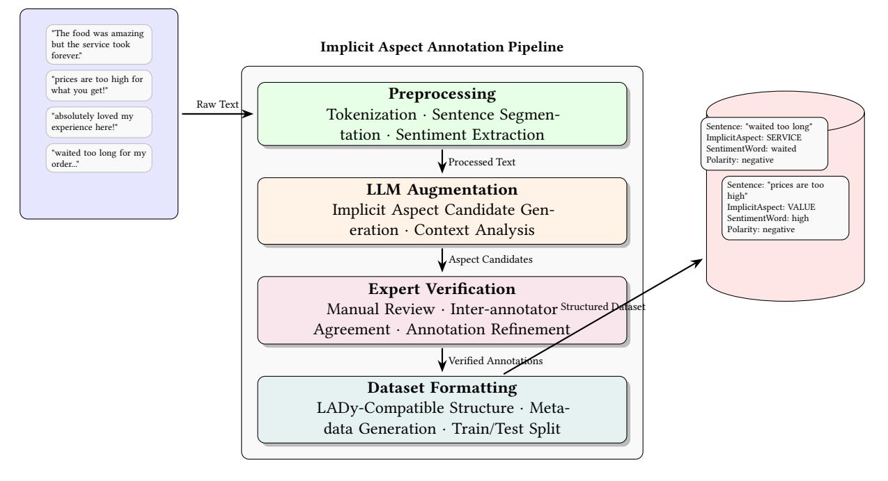

# A Benchmark Dataset for Implicit Aspect Detection

Kap Thang University of Windsor thangk@uwindsor.ca

## Abstract

Customer reviews on e-commerce platforms provide valuable insights but pose challenges due to their high volume and unstructured nature. Aspect-based sentiment analysis (ABSA) identifies opinions on product features; however, detecting implicit aspects remains difficult due to limited datasets. To our knowledge, no dedicated dataset exists for this purpose. This study aims to develop a dataset for implicit aspect detection, structuring reviews into inferred aspects, opinion words, and sentiment.

## Keywords

Implicit aspect detection, Dataset curation, Aspect-based sentiment analysis

# 1 Formal Definition

Let S denote the set of all sentences extracted from the raw review dataset, where each sentence ∈ S is derived from a review. We define the Implicit Aspect Dataset as a collection of annotated tuples:

$$
\mathcal{D} = \{ (s, a, o, p) \mid s \in \mathcal{S}, a \in \mathcal{A}, o \in O, p \in \mathcal{P} \},
$$

where:

- is a sentence that is identified as containing an implicit aspect (i.e., it has sentiment expressions without explicit aspect terms).
- is the implicit aspect category inferred for the sentence, chosen from a predefined set of aspect categories A.
- is the sentiment expression (or opinion word) extracted from the sentence based on a sentiment lexicon.
- is the sentiment polarity associated with , drawn from the set of polarities P (e.g., positive, negative, neutral).

This formalization is further detailed in Algorithm 1, which processes each sentence in the raw reviews, extracts sentiment expressions, checks for the absence of explicit aspect terms, applies implicit aspect identification, and annotates the sentence accordingly.

# 2 Dataset Curation and Annotation Process

We transform raw review data into the Implicit Aspect Dataset following our formal definition (Section 1) and Algorithm 1. The process consists of:

- Preprocessing: Clean raw reviews (e.g., remove HTML tags and special characters) and segment them into sentences.
- Annotation: For each sentence, extract sentiment expressions using a SentimentLexicon. If explicit aspect terms are absent, assign an implicit aspect from AspectCategories and create an annotation in the format

[Sentence, ImplicitAspect, SentimentWord, Polarity]

- LLM Data Augmentation and Verification [\[1,](#page-1-0) [2,](#page-1-1) [4\]](#page-1-2): Employ large language models (LLMs) to generate additional candidate annotations to improve coverage. These LLMgenerated annotations are then validated and refined by domain experts.
- Finalization: Convert the curated annotations into the required data structure, enrich them with metadata, and split the dataset into training and evaluation sets.

## 3 LADy Framework Architecture

Our work leverages a fork of the LADy (Latent Aspect Detection) framework, extended to support implicit aspect detection. The framework features:

- Modular Design [\[5\]](#page-1-3): Organized into distinct modules for data preprocessing, aspect modelling, sentiment analysis, and evaluation.
- Data Processing Pipeline [\[3\]](#page-1-4): Supports multiple dataset formats via dedicated loaders, augmentation (e.g., backtranslation), and configurable splitting into training, validation, and test sets.
- Diverse Model Support: Integrates multiple model architectures including probabilistic topic models (LDA, BTM), neural topic models (CTM, Neural-LDA), transformer-based models (BERT), and embedding approaches (FastText), all through a unified interface for aspect detection and sentiment analysis.
- Implementation: Developed in Python using PyTorch and supporting libraries (NLTK, pandas, numpy), with consistent interfaces for training and inference.

#### 4 Acknowledgement and Source Code

Our work utilizes a fork of the LADy (Latent Aspect Detection) framework, an open-source tool for aspect-based sentiment analysis. We leverage this framework for our research on implicit aspect detection while maintaining compatibility with the original pipeline architecture. The LADy framework includes several key components that facilitate a quick start and streamline result reproduction:

- Comprehensive README: Documentation covering project bio, installation instructions, feature summaries, and licensing details.
- Quickstart Script: A script that allows users to rapidly launch experiments and replicate results.
- Reproducible Pipeline: A streamlined workflow ensures that experiments are both reproducible and repeatable.

The original documentation and instructions remain relevant and are available in our repository.[1](#page-0-0)

1<https://github.com/thangk/LADy>

#### Figure 1: Flow overview of the LADy architecture with an implicit aspect dataset preprocessing pipeline.

#### Algorithm 1 ImplicitAspectPreprocessing

Require: RawReviews, AspectCategories, SentimentLexicon Ensure: ImplicitAspectDataset

- 1: Initialize ImplicitAspectDataset ← []
- 2: for each Review in RawReviews do
- 3: Segment Review into sentences
- 4: for each Sentence in Review do
- 5: Extract sentiment expressions using SentimentLexicon
- 6: Determine if Sentence contains explicit aspect terms
- 7: if sentiment exists AND no explicit aspect terms detected then
- 8: Apply implicit aspect identification
- 9: Determine most likely AspectCategory for the sentiment
- 10: Create annotation: [Sentence, ImplicitAspect, SentimentWord, Polarity]
- 11: Add to ImplicitAspectDataset
- 12: end if
- 13: end for
- 14: end for
- 15: Verify annotations with domain experts
- 16: Sample subset of annotations for manual verification
- 17: Calculate inter-annotator agreement
- 18: Refine ambiguous annotations
- 19: Format ImplicitAspectDataset to match pipeline input requirements
- 20: Convert annotations to the required data structure
- 21: Assign implicit aspect annotations to specified categories
- 22: Create metadata for tracking implicit aspects
- 23: Split ImplicitAspectDataset into training and evaluation sets
- 24: return ImplicitAspectDataset

## References

- [1] Tom B. Brown, Benjamin Mann, Nick Ryder, Melanie Subbiah, Jared Kaplan, Prafulla Dhariwal, Arvind Neelakantan, Pranav Shyam, Girish Sastry, Amanda Askell, Sandhini Agarwal, Ariel Herbert-Voss, Gretchen Krueger, Tom Henighan, Rewon Child, Aditya Ramesh, Daniel M. Ziegler, Jeffrey Wu, Clemens Winter, Christopher Hesse, Mark Chen, Eric Sigler, Mateusz Litwin, Scott Gray, Benjamin Chess, Jack Clark, Christopher Berner, Sam McCandlish, Alec Radford, Ilya Sutskever, and Dario Amodei. 2020. Language models are few-shot learners. In Proceedings of the 34th International Conference on Neural Information Processing Systems (Vancouver, BC, Canada) (NIPS '20). Curran Associates Inc., Red Hook, NY, USA, Article 159, 25 pages.
- [2] Bohan Li, Yutai Hou, and Wanxiang Che. 2022. Data augmentation approaches in natural language processing: A survey. AI Open 3 (2022), 71–90. [https://doi.org/](https://doi.org/10.1016/j.aiopen.2022.03.001) [10.1016/j.aiopen.2022.03.001](https://doi.org/10.1016/j.aiopen.2022.03.001)
- [3] Duyu Tang, Bing Qin, and Ting Liu. 2016. Aspect Level Sentiment Classification with Deep Memory Network. In Proceedings of the 2016 Conference on Empirical Methods in Natural Language Processing, Jian Su, Kevin Duh, and Xavier Carreras (Eds.). Association for Computational Linguistics, Austin, Texas, 214–224. [https:](https://doi.org/10.18653/v1/D16-1021) [//doi.org/10.18653/v1/D16-1021](https://doi.org/10.18653/v1/D16-1021)
- [4] Jason Wei and Kai Zou. 2019. EDA: Easy Data Augmentation Techniques for Boosting Performance on Text Classification Tasks. In Proceedings of the 2019 Conference on Empirical Methods in Natural Language Processing and the 9th International Joint Conference on Natural Language Processing (EMNLP-IJCNLP), Kentaro Inui, Jing Jiang, Vincent Ng, and Xiaojun Wan (Eds.). Association for Computational Linguistics, Hong Kong, China, 6382–6388.<https://doi.org/10.18653/v1/D19-1670>
- [5] Wenxuan Zhang, Xin Li, Yang Deng, Lidong Bing, and Wai Lam. 2023. A Survey on Aspect-Based Sentiment Analysis: Tasks, Methods, and Challenges. IEEE Trans. on Knowl. and Data Eng. 35, 11 (Nov. 2023), 11019–11038. [https://doi.org/10.1109/](https://doi.org/10.1109/TKDE.2022.3230975) [TKDE.2022.3230975](https://doi.org/10.1109/TKDE.2022.3230975)