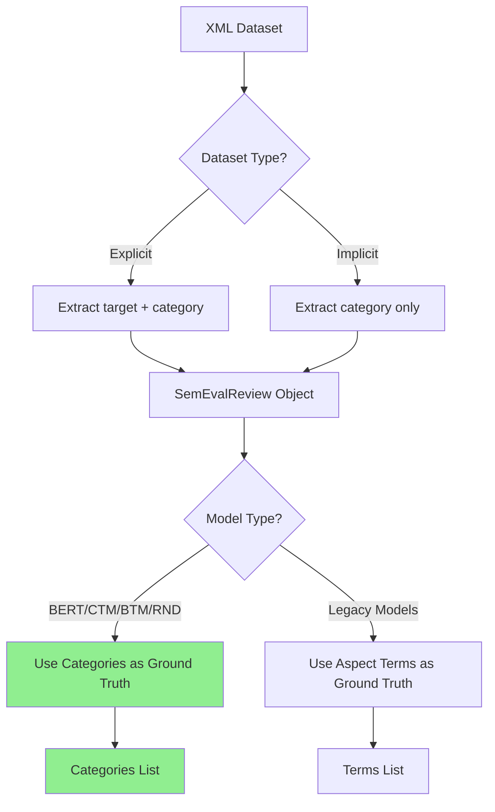
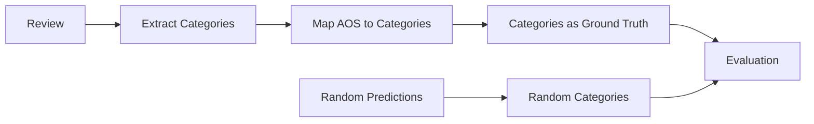
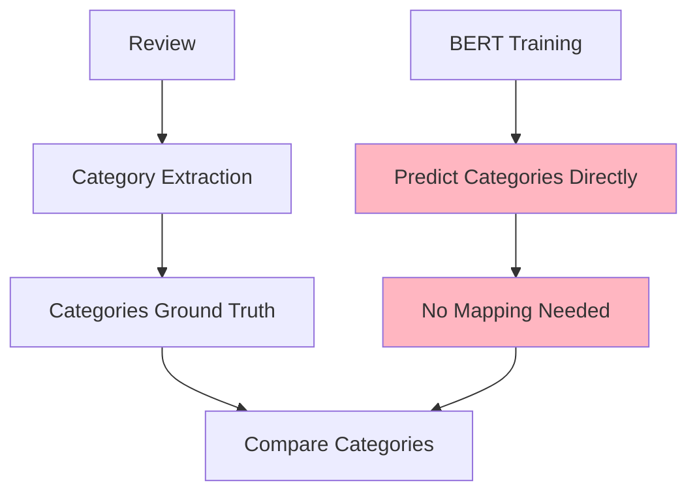
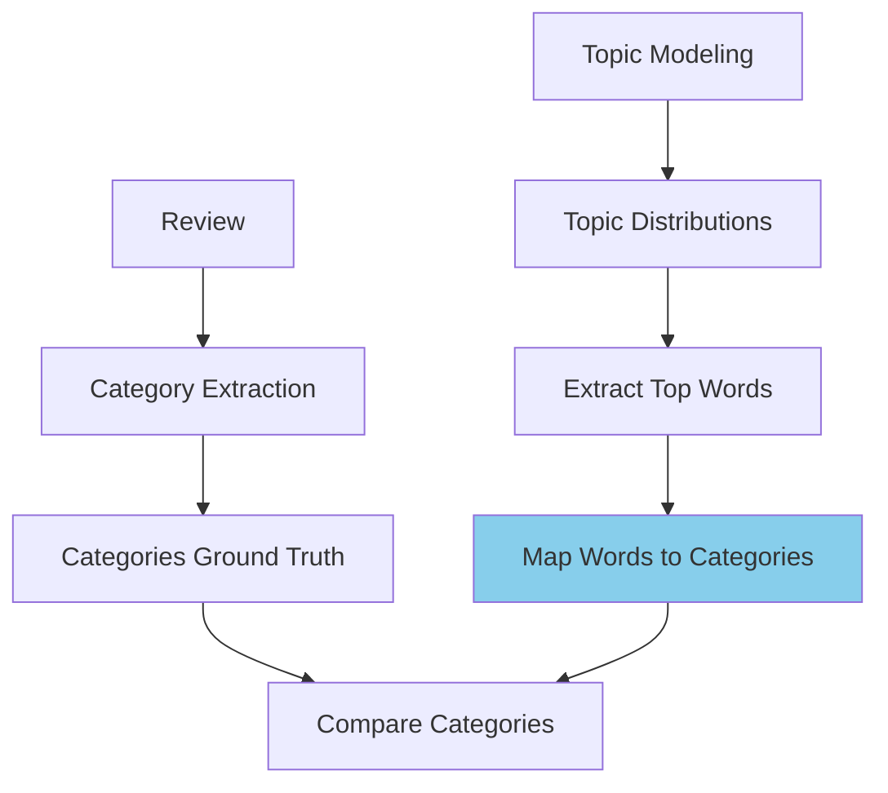
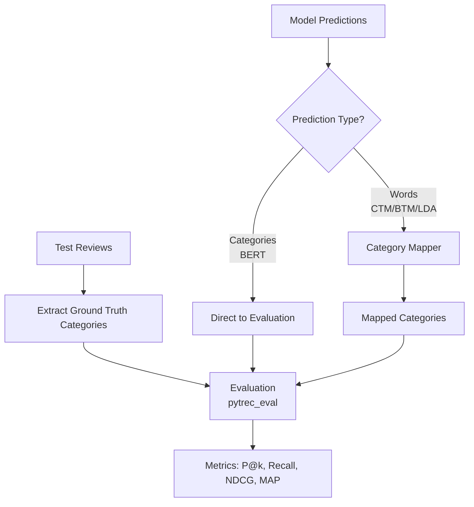

# Ground Truth System in LADy-kap: A Comprehensive Guide

## Overview

The LADy-kap system uses a sophisticated ground truth extraction and evaluation mechanism that supports both **explicit** and **implicit** aspect detection. The key innovation is using **aspect categories** as the unified ground truth format, enabling fair comparison across different model architectures.

## Table of Contents
1. [Understanding the Data](#understanding-the-data)
2. [Ground Truth Extraction Flow](#ground-truth-extraction-flow)
3. [Model-Specific Implementations](#model-specific-implementations)
4. [Prediction and Evaluation Flow](#prediction-and-evaluation-flow)
5. [Key Design Decisions](#key-design-decisions)

## Understanding the Data

### SemEval XML Format

The SemEval datasets contain two types of aspect annotations:

```xml
<Opinion target="food" category="FOOD#QUALITY" polarity="positive" from="4" to="8"/>
```

- **target**: The actual aspect term/word in the text (e.g., "food", "service")
- **category**: The semantic category (e.g., "FOOD#QUALITY", "SERVICE#GENERAL")

### Implicit vs Explicit Aspects

- **Explicit aspects**: Have a `target` attribute (actual words in text)
- **Implicit aspects**: Have `target="NULL"` (category exists but no specific words)

## Ground Truth Extraction Flow



### Detailed Extraction Process

1. **Data Loading** (`src/cmn/semeval.py`):
   ```python
   # For each opinion in the XML:
   aspect = (opinion.attrib["target"], from_idx, to_idx)
   category = opinion.attrib["category"]  # e.g., "FOOD#QUALITY"
   sentiment = opinion.attrib["polarity"]
   ```

2. **Review Object Creation**:
   - `aos`: List of (aspect_indices, opinion_indices, sentiment, aspect_term)
   - `category`: List of categories corresponding to each aos entry
   - `implicit`: Boolean array marking which aspects are implicit

## Model-Specific Implementations

### 1. Random Model (RND)



**Key Code** (`src/aml/rnd.py`):
```python
# Extract categories for each AOS entry
for sentence_idx, sentence_aos in enumerate(r.aos):
    for aos_idx, aos_instance in enumerate(sentence_aos):
        category_idx = sum(len(r.aos[i]) for i in range(sentence_idx)) + aos_idx
        if category_idx < len(r.category):
            true_aspect_categories.add(r.category[category_idx])
```

### 2. BERT Model



**Key Fix**: BERT already predicts categories, so no category mapping is needed.

### 3. CTM/BTM Models



**Process**:
1. Extract categories as ground truth
2. Predict topic distributions
3. Convert topics to words via `get_aspect_words()`
4. Map predicted words to categories using `category_mapper`

## Prediction and Evaluation Flow



### Category Mapper (`src/cmn/category_mapper.py`)

The mapper converts predicted words to categories using semantic similarity:

```python
category_keywords = {
    'FOOD#QUALITY': ['food', 'dish', 'meal', 'cuisine', 'flavor', ...],
    'SERVICE#GENERAL': ['service', 'staff', 'waiter', 'waitress', ...],
    'AMBIENCE#GENERAL': ['atmosphere', 'ambience', 'environment', ...],
    # ... more categories
}
```

### Evaluation Process (`src/main.py`)

```python
# 1. Build ground truth (qrel)
for pair in pairs:
    for category in pair[0]:  # Ground truth categories
        qrel[f'q{i}'][category] = 1

# 2. Build predictions (run)
if model_type != 'bert':
    # Map word predictions to categories
    mapped_predictions = category_mapper.map_predictions_batch(pair[1])
else:
    # BERT predictions are already categories
    mapped_predictions = pair[1]

for category, score in mapped_predictions:
    run[f'q{i}'][category] = score

# 3. Evaluate using pytrec_eval
evaluator = pytrec_eval.RelevanceEvaluator(qrel, measures)
results = evaluator.evaluate(run)
```

## Key Design Decisions

### 1. Why Categories as Ground Truth?

- **Unified evaluation**: Both implicit and explicit aspects have categories
- **Fair comparison**: All models evaluated on the same category taxonomy
- **Semantic consistency**: Categories provide stable semantic targets

### 2. Model-Specific Handling

| Model | Prediction Type | Mapping Required | Rationale |
|-------|----------------|------------------|-----------|
| BERT | Categories | No | Pre-trained on category classification |
| CTM/BTM | Words | Yes | Topic models discover latent word distributions |
| LDA | Words | Yes | Traditional topic modeling approach |
| RND | Random | Minimal | Baseline comparison |

### 3. Handling Edge Cases

1. **Missing Categories**: If a review has no categories, it's skipped
2. **Misaligned AOS-Category**: Uses fallback to include all categories
3. **Empty Predictions**: Returns empty pairs to allow pipeline continuation

## Benefits of This Approach

1. **Consistency**: All models evaluated on same ground truth format
2. **Flexibility**: Supports both implicit and explicit aspect detection
3. **Interpretability**: Categories are human-readable and semantically meaningful
4. **Extensibility**: Easy to add new models by following the pattern

## Common Pitfalls and Solutions

### Problem: Zero Evaluation Metrics
**Cause**: Mismatch between ground truth and prediction formats
**Solution**: Ensure proper category extraction and mapping

### Problem: BERT Predictions Double-Mapped
**Cause**: Applying category_mapper to already-categorized predictions
**Solution**: Skip mapping for BERT predictions

### Problem: Different Results for Implicit/Explicit
**Cause**: Different ground truth extraction logic
**Solution**: Unified category-based approach for all datasets

## Implementation Checklist for New Models

When adding a new aspect detection model:

1. ✅ Implement category-based ground truth extraction in `infer_batch()`
2. ✅ Decide prediction format (categories or words)
3. ✅ If predicting words, ensure category_mapper is applied in evaluation
4. ✅ Test with both implicit and explicit datasets
5. ✅ Verify non-zero evaluation metrics

## Conclusion

The LADy-kap ground truth system provides a robust framework for comparing diverse aspect detection models. By standardizing on categories as the evaluation target and providing appropriate mappings for word-based predictions, the system ensures fair and meaningful comparisons across different modeling approaches.